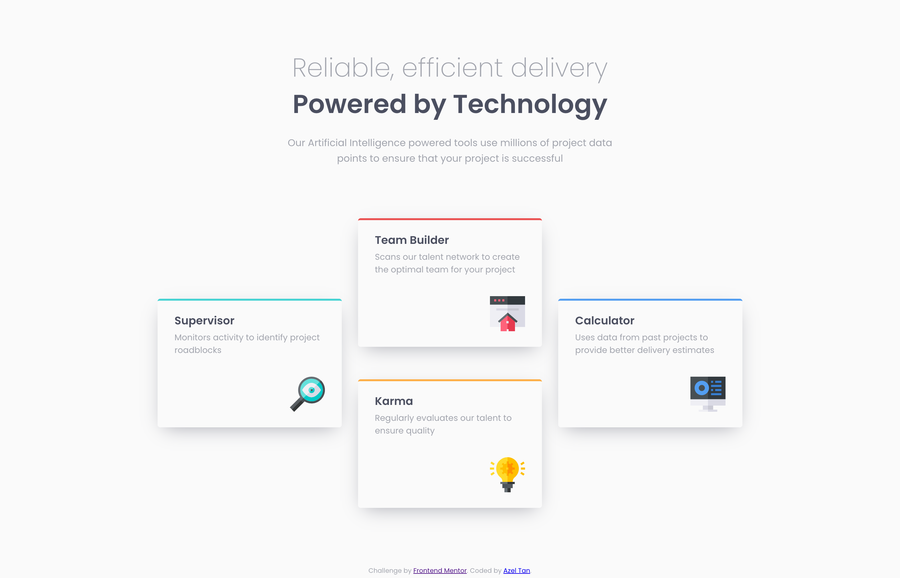

# Frontend Mentor - Four card feature section solution

This is a solution to the [Four card feature section challenge on Frontend Mentor](https://www.frontendmentor.io/challenges/four-card-feature-section-weK1eFYK). Frontend Mentor challenges help you improve your coding skills by building realistic projects. 

## Table of contents

- [Overview](#overview)
  - [The challenge](#the-challenge)
  - [Screenshot](#screenshot)
  - [Links](#links)
- [My process](#my-process)
  - [Built with](#built-with)
  - [What I learned](#what-i-learned)
  - [Continued development](#continued-development)
  - [Useful resources](#useful-resources)
- [Author](#author)

## Overview

### The challenge

Users should be able to:

- View the optimal layout for the site depending on their device's screen size

### Screenshot



**Note: Delete this note and the paragraphs above when you add your screenshot. If you prefer not to add a screenshot, feel free to remove this entire section.**

### Links

- Solution URL: [Solution URL](https://github.com/azelalynetan/azel.frontend-mentor--four-card-feature-section)
- Live Site URL: [Live Site](https://azelalynetan.github.io/azel.frontend-mentor--four-card-feature-section)

## My process

### Built with

- Semantic HTML5 markup
- Used CSS Vars, REM and EM for measurements
- Flexbox for mobile layout
- CSS Grid for Desktop layout
- Mobile-first workflow

### What I learned

I'm used to pixels and this time, I tried using REM for font-sizes and EM for spacings and sizes. I learned that I can set the global font size to 62.5% thus it's easier now to convert pixel to REM.
```css
html {
  font-size: 62.5%;
}
```

I also tried my best to use semantic HTML5 markup, I hope i'm using it correctly. 
I'm comfortable on using Flexbox but I challenged myself this time and learned how to use CSS Grid for the desktop layout. And lastly, it's my first time to do the mobile first workflow when applying the styles. 

### Continued development

I want to practice CSS grid more, do more challenges using mobile-first workflow and improve code accessibility, readability and maintenance. 

### Useful resources

- [Why font-size must NEVER be in pixels](https://fedmentor.dev/posts/font-size-px/) - This made me think to try using REM instead of pixels.
- [HTML Font Size Hack](https://fedmentor.dev/posts/rem-html-font-size-hack/) - Interesting hack
- [CSS Reset](https://www.joshwcomeau.com/css/custom-css-reset) - Simple CSS Reset

## Author

- Website - [Add your name here](https://www.your-site.com)
- Frontend Mentor - [@yourusername](https://www.frontendmentor.io/profile/yourusername)
- Twitter - [@yourusername](https://www.twitter.com/yourusername)

- Website - [https://azelalynetan.github.io/](azelalynetan)
- Frontend Mentor - [https://www.frontendmentor.io/profile/azelalynetan](@azelalynetan)
- Mastodon - [https://mastodon.social/@azeltan](@azeltan@mastodon.social)
